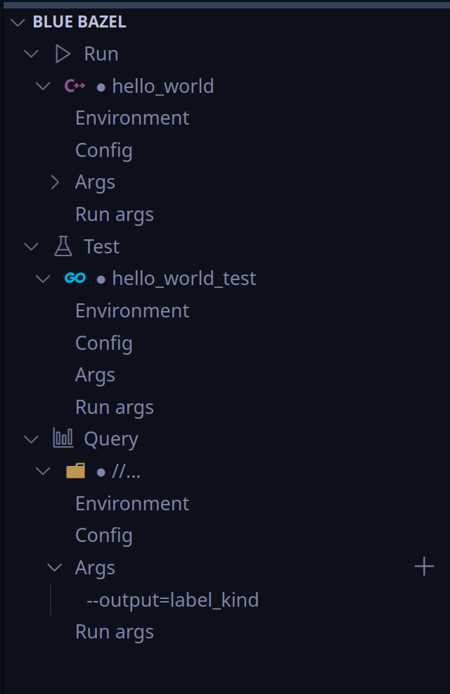

#  Blue Bazel
## VS Code Extension for Bazel projects

This extension provides integration into Visual Studio Code for building, running, debugging, and testing bazel or dazel projects.




Follow the steps to install the extension:

1. Select Extensions (Ctrl + Shift + X)
2. Open "More Action" menu
3. Click "Install from VSIX..."
4. Select VSIX file
5. Reload VScode

The VSIX files can be found in the releases folder. Unless you would like to modify the extension,
you do not need to build it.

After installing the extension, a BLUE BAZEL view will be added  to the explorer panel:

## How to Build (for extension developers)

1. Run `npm install` in the project root folder.
2. Build with `npm run compile`.
3. Generate `vsix` file by running `vsce package --out=<package_name>`.

## Keyboard Binding

Follow the steps below to bind keyboard shortcuts to specific commands that are provided by this extension:

1. Open "Preferences: Open Keyboard Shortcuts (JSON)" via Ctrl + Shift + P.
2. Add a key shortcut for a command like this:

```json
{
    "key": "<keyboard-shortcut>",
    "command": "<command>"
}
```

### Commands

1. **bluebazel.build** - Build the selected build target
2. **bluebazel.run** - Run the selected run target
3. **bluebazel.debug** - Debug the selected run target
4. **bluebazel.test** - Test the selected test target
5. **bluebazel.editRunArgs** - Set run arguments for the currently selected run target
6. **bluebazel.editTestArgs** - Set test arguments for the currently selected test target
7. **bluebazel.clean** - Clean
8. **bluebazel.format** - Run the format command (set in settings)
9. **bluebazel.buildCurrentFile** - Build current active file
10. **bluebazel.addActionAndTarget** - Add a new action and target.

#### Example

```json
{
    "key": "ctrl+b",
    "command": "bluebazel.build"
}
```

## Custom Buttons

It is possible to add buttons with custom commands to the bazel view container.

The extension introduces two different types of configuration which allows users to define their own shell
commands with a set of keywords that make it possible to interact with the other user variables such as
selected run target, build target etc.

In order to add new buttons and commands to the bazel view container, please open the bazel extension settings
in vscode (Settings -> Extensions -> Blue bazel) and click on the relevant "Edit in settings.json" so as to get the
default values filled in in the settings.json file before modifying them:

### Shell Commands configuration

Shell Commands configuration defines a set of functions, which can be called by wrapping the name of the
configuration between `<` and `>`.

The configuration has the following syntax:

```json
"bluebazel.shellCommands": [
    {
        "name": "myCommand1",
        "command": "A shell command"
    }
]
```

Example:

```json
"bluebazel.shellCommands": [
    {
        "name": "myEcho",
        "command": "echo this is my custom shell command"
    },
    {
        "name": "myEchoEcho",
        "command": "echo <myEcho>" // This will execute the command `myEcho` and echo the result.
    }
]
```

### Custom Button configuration

Custom buttons configuration allows the user to add sections and buttons to the bazel view container, and link
them to a command.

A custom button configuration has the following syntax:

```json
"bluebazel.customButtons": [
    {
        "title": "MyCustomSection",
        "buttons": [
            {
                "title": "MyCustomButton",
                "command": "command to run on shell",
                "description": "MyCustomButton description",
                "tooltip": "MyCustomButton tooltip",
                "methodName": "bluebazel.myCustomButton" // Unique methodName can be used to bind keyboard to the command.
            },
            {
                "title": "MyCustomButton2",
                "command": "command to run on shell",
                "description": "MyCustomButton2 description",
                "tooltip": "MyCustomButton2 tooltip",
                "methodName": "bluebazel.myCustomButton2"
            }
        ]
    }
]
```

Note that commands in custom buttons can call the shell commands. Here is an example:

```json
"bluebazel.customButtons": [
    {
        "title": "MyCustomSection",
        "buttons": [
            {
                "title": "Echo something",
                "command": "echo <myEchoEcho>", // Calls myEchoEcho from shell commands.
                "description": "Echoes something",
                "tooltip": "Echoes something",
                "methodName": "bluebazel.echoEcho"
            }
        ]
    }
]
```

Note that a new button can also be added to an existing section by setting the title to the corresponding
section's title.

### Keywords

There are several keywords that can be used to receive user inputs:

1. ${bluebazel.runTarget}: Current run target. Example: `//src/application:application`.
2. ${bluebazel.buildTarget}: Current build target. Example: `//src/application/...`.
3. ${bluebazel.testTarget}: Current test target.
4. ${bluebazel.bazelBuildArgs}: Current bazel build arguments.
5. ${bluebazel.bazelRunArgs}: Current bazel run arguments.
6. ${bluebazel.bazelTestArgs}: Current bazel test arguments.
7. ${bluebazel.runArgs}: Current run arguments.
8. ${bluebazel.testArgs}: Current test arguments.
9. ${bluebazel.buildConfigs}: Current list of build configs. Example: `--config=debug`.
10. ${bluebazel.runConfigs}: Current list of run configs. Example: `--config=debug`.
11. ${bluebazel.testConfigs}: Current list of test configs. Example: `--config=debug`.
12. ${bluebazel.executable}: The current executable path to bazel. Example: `./bazel`.
13. ${bluebazel.buildEnvVars}: The current build environment variables.
14. ${bluebazel.runEnvVars}: The current run environment variables.
15. ${bluebazel.testEnvVars}: The current test environment variables.
16. ${bluebazel.testEnvVars}: The current test env variables.
17. ${bluebazel.formatCommand}: The current format command. Example: `run //:format`.

Here are additional keywords to receive user input at the time of the execution:

1. [Pick(`arg`)]: This shows an item list for the user to choose one from. `arg` must be a command that returns multiline string where each line corresponds to an item.
2. [Input()]: This receives a plain string input from the user.

### A complete example

This example illustrates the `Test` button:

```json
"bluebazel.customButtons": [
    {
        "title": "Run",
        "buttons": [
            {
                "title": "Test",
                "command": "bazel test ${bluebazel.testConfigs} --build_tests_only --test_timeout=1500 [Pick(<testTarget>)] --test_arg=${bluebazel.testArgs}",
                "description": "Test in sandbox",
                "tooltip": "Run target with `bazel test`",
                "methodName": "bluebazel.test"
            }
        ]
    }
],
"bluebazel.shellCommands": [
    {
        "name": "testTargetHelper",
        "command": "echo ${bluebazel.testTarget} | cut -d':' -f 1 | awk '{print $1\"/...\"}'"
    },
    {
        "name": "testTarget",
        "command": "bash -c 'source scripts/envsetup.sh > /dev/null && bazel query \"tests(<testTargetHelper>)\""
    }
]
```

`testTargetHelper` receives the current run target which returns a value in the form of `//<path>:<target>`, and
modifies it to return something in the form of `//path/...`.

`testTarget` gives this input to `bazel query` to return all available tests in this path.

Finally, the button `Test` uses the output of `testTarget` to display the user the list of tests to choose from,
and executes the test using the current configs and run arguments.

## Releases

See [Release Notes](ReleaseNotes.md)
